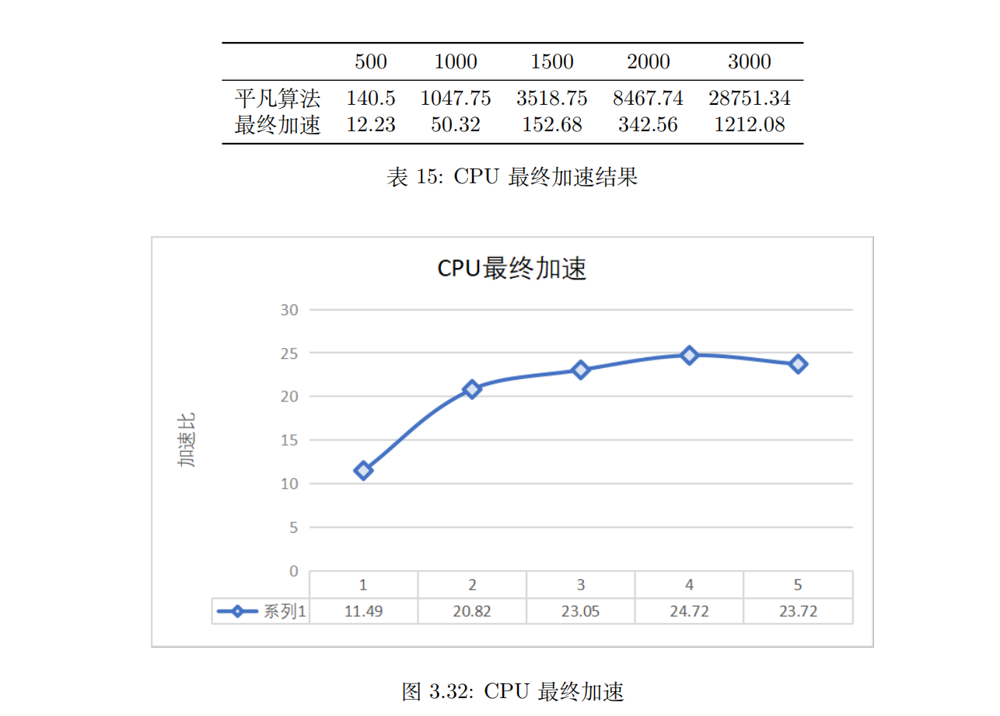
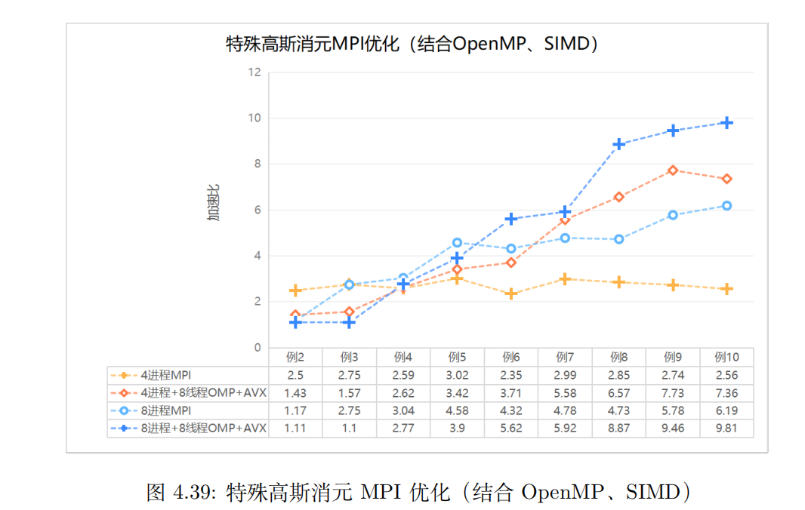

# Parallel-Programm design and CUDA programming
#### Description
Parallel Program Design 

## 1. Problem Restatement
### 1.1 Basic Gaussian Elimination
### 1.2 Special Gaussian Elimination
### 1.3 Research History and Current Status
### 1.4 Correctness Verification Explanation
### 1.5 Experimental Time Measurement Explanation

## 2. Experimental Platform and Compilation Options
### 2.1 Experimental Platform
### 2.2 Compilation Options
#### 2.2.1 Compilation Options on ARM Platform
#### 2.2.2 SIMD and Pthread OpenMP Experiments on Code Blocks

## 3. Parallel Optimization of Basic Gaussian Elimination
### 3.1 SIMD Optimization Exploration
#### 3.1.1 Experimental Design
#### 3.1.2 ARM Platform - NEON Instruction Set
#### 3.1.3 X86 Platform - SSE, AVX, AVX512 Instruction Set
#### 3.1.4 Other SIMD Optimization Attempts

### 3.2 Pthread Optimization Exploration
#### 3.2.1 Experimental Design
#### 3.2.2 Partitioning Methods and Synchronization Mechanisms
#### 3.2.3 Comparison between ARM and x86 Platforms

### 3.3 OpenMP Optimization Exploration
#### 3.3.1 Load Balancing Task Partitioning
#### 3.3.2 Experimenting with Changing Chunksize
#### 3.3.3 Changing Number of Threads
#### 3.3.4 Combining OpenMP with SIMD

### 3.4 Comparison of Pthread and OpenMP, and Other Optimizations
#### 3.4.1 Performance Differences between Pthread and OpenMP
#### 3.4.2 Cache Optimization and Column-wise Partitioning

### 3.5 MPI Optimization Exploration
#### 3.5.1 Experimental Design
#### 3.5.2 Exploration of Different Numbers of Processes
#### 3.5.3 Exploration of Data Partitioning Methods
#### 3.5.4 Comparison between x86 and ARM Platforms
#### 3.5.5 Non-blocking Communication MPI Exploration
#### 3.5.6 Improvement through MPI Pipeline
#### 3.5.7 Combining MPI, Multithreading, and SIMD

### 3.6 Final CPU Optimization Methods

#### Relationship Between Data Size and Speedup

Lower Speedup at Smaller Data Sizes: When the data size is 500, the speedup is relatively low. This may be due to the smaller data size, which prevents the parallel processing advantages from fully manifesting. Additionally, process communication and thread management overheads may consume a significant portion of resources at this scale, impacting the overall acceleration effect.

Stable Performance at Larger Data Sizes: When the data size reaches 1000, the speedup stabilizes above 20x, peaking at 24.72x. This indicates that, as the data size increases, the parallel acceleration methods used this semester are able to better utilize computational resources, achieving more efficient processing.

Results of Algorithm Optimization: Through parallel acceleration efforts, the execution time of the Gaussian elimination algorithm has been reduced from thousands or tens of thousands of milliseconds to just a few hundred milliseconds, a significant improvement. This not only enhances the efficiency of the algorithm but also enables the possibility of handling larger-scale problems.

#### Summary
This semester’s work has not only explored various acceleration methods theoretically but has also achieved remarkable results in practice. By combining SIMD acceleration, multithreading with OpenMP, and non-blocking communication with MPI, an efficient parallelization of the Gaussian elimination algorithm has been realized.

### 3.7 GPU Optimization Exploration
#### 3.7.1 CUDA Programming Optimization
#### 3.7.2 GPU Acceleration Attempts on OneAPI Platform

## 4. Parallelization of Special Gaussian Elimination
### 4.1 SIMD Optimization
#### 4.1.1 X86 Platform - SSE, AVX, AVX512 Instruction Set
#### 4.1.2 Experimental Results
#### 4.1.3 Optimization of Compilation Options

### 4.2 OpenMP and Pthread Optimization
#### 4.2.1 Pthread Optimization Approach
#### 4.2.2 OpenMP Optimization Approach
#### 4.2.3 Experimental Results

### 4.3 MPI Optimization
#### 4.3.1 Algorithm Design
#### 4.3.2 Experimental Results

#### Performance Summary of the Special Gaussian Elimination Algorithm with MPI, OpenMP, and SIMD (AVX)
Significant Performance Improvement with MPI Optimization: The use of 4-process MPI typically achieved around a 2.5 to 3x speedup. When scaling to 8-process MPI for larger datasets, the speedup reached 5 to 6x, demonstrating good scalability.

Optimization Strategy for Small Datasets: For smaller datasets, the overhead associated with process and thread management, as well as inter-process communication, may increase with the number of processes. This can negate the performance gains from parallel computation.

Optimal Configuration for Large Datasets: When processing extremely large datasets (as shown in Example 10), the combination of 8 processes, 8 threads, and AVX instruction set optimizations yielded the best performance, achieving nearly a 10x speedup. This is the highest speedup achieved this semester with the special Gaussian elimination algorithm.

#### Conclusion
In conclusion, the parallelization of the special Gaussian elimination algorithm requires selecting appropriate parallel strategies based on the dataset size. The combination of MPI multi-process optimization, OpenMP multi-threading, and AVX (SIMD) instruction sets can result in significant speedup for large-scale data processing.

